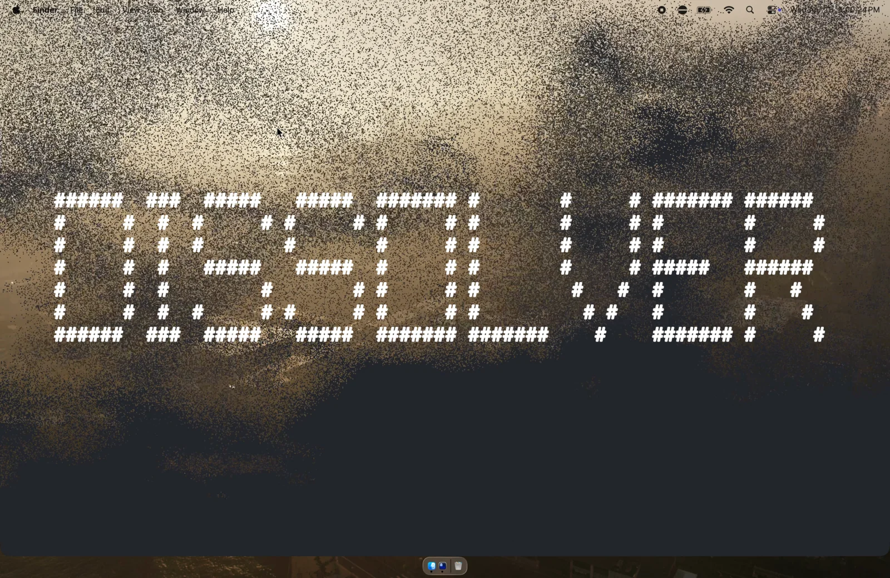

# dissolve

dissolves all visible macos windows into floating embers via a metal shader

<video src="https://github.com/financialvice/dissolve/raw/main/demo.mp4" controls></video>

- build: `swift build -c release && cp .build/release/Dissolve /usr/local/bin/dissolve`
- run: `dissolve`
- first launch will ask for screen recording permission, grant it in system settings then run again
- hidden apps come back on next click or cmd-tab
